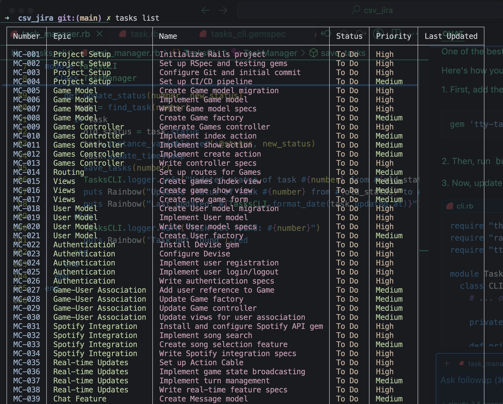

# TasksCLI

TasksCLI is a command-line interface tool for managing tasks stored in a CSV file. It allows you to list, filter, view, and update tasks efficiently from your terminal.


## Features

- List all tasks
- Filter tasks by field and value
- View detailed information for a specific task
- Update task status
- Colorful output for better readability




## Installation

Install the gem by running:

```
gem install tasks_cli
```

## Configuration

TasksCLI expects a CSV file located at `~/tasks.csv`. Ensure this file exists and has the correct format before using the tool.

### CSV Format

The CSV file should have the following columns:

1. Epic Name
2. Ticket Number
3. Ticket Name
4. Ticket Description
5. Priority
6. Status
7. Relates To [Array]
8. Blocked By [Array]
9. Updated At (optional)

Example:

```
Epic Name,Ticket Number,Ticket Name,Ticket Description,Priority,Status,Relates To,Blocked By,Updated At
Epic 1,1,Task 1,Description 1,High,To Do,,,
Epic 1,2,Task 2,Description 2,Medium,In Progress,,,
Epic 1,3,Task 3,Description 3,Low,Done,,,
```

## Usage

### Listing Tasks

To list all tasks, run:

```
tasks list
```

### Filtering Tasks

To filter tasks by a specific field and value, run:

```
tasks filter FIELD:VALUE
```

Replace `FIELD` with the column name and `VALUE` with the value you want to filter by.

For example, to filter tasks by Epic 1:

```
tasks filter "Epic Name":"Epic 1" 
```

### Viewing Task Details

To view details of a specific task, run:

```
tasks view NUMBER
```

### Updating Task Status

To update the status of a task, run:

```
tasks update NUMBER STATUS
```

Replace `NUMBER` with the ticket number and `STATUS` with the new status you want to set.

## License

This project is licensed under the MIT License. See the `LICENSE` file for more details.


